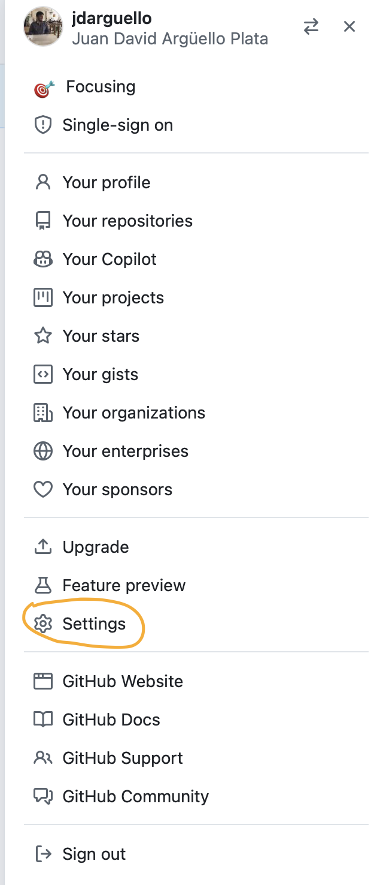

## Instalación de FluxCD

Lo primero que haremos será instalar FluxCD y relacionarlo con un repositorio GitHub, acorde a lo definido en la [documentación oficial](https://fluxcd.io/flux/installation/bootstrap/github/). 

### 1. Generar el token de GitHub

Como vamos a relacionar un repositorio GitHub con nuestro clúster, lo primero que necesitamos es un token válido con nuestras credenciales para que el clúster pueda acceder a la información contenida en el repo y definir el __estado deseado__ que genere el proceso de _reconciliación_ respecto al estado actual de nuestra infraestructura.

Para generar un token de GitHub, accedemos a la sección de __"developer settings"__ como se muestra en la Figura 1.

